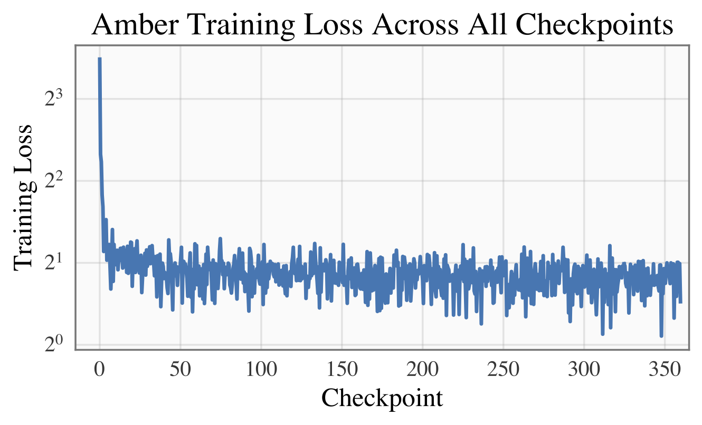
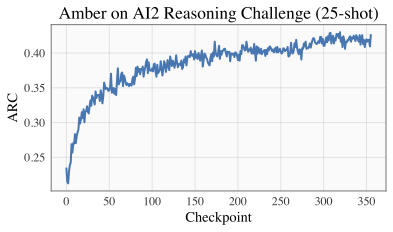
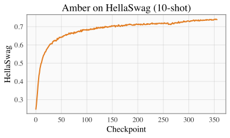
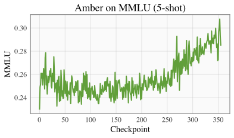
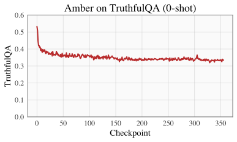

<h1 align="center">Amber: the first model of LLM360</h1>

<div align="center">
   <br><br>
</div>

---

<p align="center">
   <a href="https://github.com/LLM360/Analysis360/blob/dev/LICENSE"></a>
</p>
<p align="center">
🤗 <a href="https://huggingface.co/LLM360/Amber">[Amber Download]</a> • 🤗 <a href="https://huggingface.co/LLM360/AmberChat">[AmberChat Download]</a>  • 📈 <a href="https://github.com/LLM360/Analysis360/blob/main/README.md#list-of-analysis-and-metrics
">[Analysis and Results]</a> • 📗 <a href="https://huggingface.co/datasets/LLM360/AmberDatasets">Pretraining Dataset</a>
</p>


## About LLM360
LLM360 is an initiative for comprehensive and fully open-sourced LLMs, 
where all training details, model checkpoints, intermediate results, and 
additional analyses are made available to the community. Our goal is to advance 
the field by inviting the community to deepen the understanding of LLMs 
together. As the first step of the project LLM360, we release all intermediate 
model checkpoints, our fully-prepared pre-training dataset, all source code and
configurations, and training details. We are
committed to continually pushing the boundaries of LLMs through this open-source 
effort.

Get access now at [LLM360 site](https://www.llm360.ai/)

## Model Description
Amber is the first model in the LLM360 family. Amber is an 7B English language model with the LLaMA architecture.

- **Model type:** Language model with the same architecture as LLaMA-7B
- **Language(s) (NLP):** English
- **License:** Apache 2.0
- **Resources for more information:**
  - [Training Code](https://github.com/LLM360/amber-train)
  - [Data Preparation](https://github.com/LLM360/amber-data-prep)
  - [Metrics](https://github.com/LLM360/Analysis360)
  - [Fully processed Amber pretraining data](https://huggingface.co/datasets/LLM360/AmberDatasets)


# Loading Amber 

```python
from transformers import LlamaTokenizer, LlamaForCausalLM

tokenizer = LlamaTokenizer.from_pretrained("LLM360/Amber", revision="ckpt_356")
model = LlamaForCausalLM.from_pretrained("LLM360/Amber", revision="ckpt_356")

input_text = "translate English to German: How old are you?"
input_ids = tokenizer(input_text, return_tensors="pt").input_ids

outputs = model.generate(input_ids)
print(tokenizer.decode(outputs[0]))
```

# Amber Training Details

## DataMix
| Subset      | Tokens (Billion) |
| ----------- | ----------- |
| Arxiv      | 30.00       |
| Book   | 28.86        |
| C4   | 197.67        |
| Refined-Web   | 665.01        |
| StarCoder   | 291.92        |
| StackExchange   | 21.75        |
| Wikipedia   | 23.90        |
| Total | 1259.13 |

## Hyperparameters
| Hyperparameter      | Value |
| ----------- | ----------- |
| Total Parameters      | 6.7B       |
| Hidden Size   | 4096        |
| Intermediate Size (MLPs)   | 11008        |
| Number of Attention Heads   | 32        |
| Number of Hidden Layers  | 32        |
| RMSNorm ɛ  | 1e^-6        |
| Max Seq Length   | 2048        |
| Vocab Size | 32000 |

| Training Loss                                                          |
|------------------------------------------------------------------------|
|  |


# Evaluation

| ARC                                                 | HellaSwag                                                  | 
|------------------------------------------------------|------------------------------------------------------------|
|  |  | 

|MMLU                                                 | TruthfulQA                                                 |
|-----------------------------------------------------|-----------------------------------------------------------|
| |  |

# Citation

**BibTeX:**

```bibtex
@misc{liu2023llm360,
      title={LLM360: Towards Fully Transparent Open-Source LLMs}, 
      author={Zhengzhong Liu and Aurick Qiao and Willie Neiswanger and Hongyi Wang and Bowen Tan and Tianhua Tao and Junbo Li and Yuqi Wang and Suqi Sun and Omkar Pangarkar and Richard Fan and Yi Gu and Victor Miller and Yonghao Zhuang and Guowei He and Haonan Li and Fajri Koto and Liping Tang and Nikhil Ranjan and Zhiqiang Shen and Xuguang Ren and Roberto Iriondo and Cun Mu and Zhiting Hu and Mark Schulze and Preslav Nakov and Tim Baldwin and Eric P. Xing},
      year={2023},
      eprint={2312.06550},
      archivePrefix={arXiv},
      primaryClass={cs.CL}
}
```
